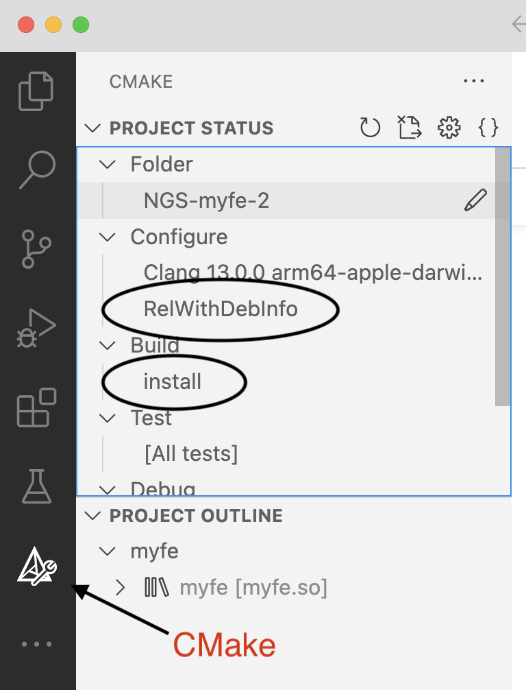
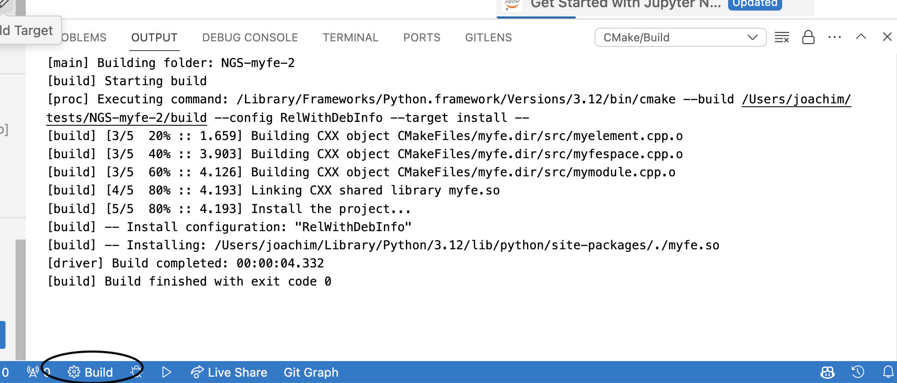

# NGS-myfe

Installation:

* Install a recent NGSolve (version from March 30 or newer), install via
    
      pip install --upgrade --pre ngsolve  

* Build and install using command-line tools (for experts): 
 
  install git, CMake, a recent C++ compiler (gcc, clang)

      git clone https://github.com/TUWien-ASC/NGS-myfe.git
      cd NGS-myfe
      mkdir build
      cd build
      cmake ..
      make -j4 install

* Build and install using Visual Studio Code (recommended)

  * Install Visual Studio Code. 
  * Install a compiler, for Windows see https://code.visualstudio.com/docs/cpp/config-msvc
  * Install VS-Code extensions: GitLens, CMake Tools

  * Now, git-clone the Repository TUWien-ASC/NGS-myfe from github

     
 
   if there are more options, vscode asks for the compiler:

   

   vscode runs cmake, if everything is good the output looks like 
   

   we select the build target 'install', and 'RelWithDebInfo' configuration: 
   

   finally, we click on the 'Build' button in the blue status bar			
   

   Our own finite elements are installed !

  
* Try notebooks from https://jschoeberl.github.io/iFEM/FEM/myFiniteElement.html

